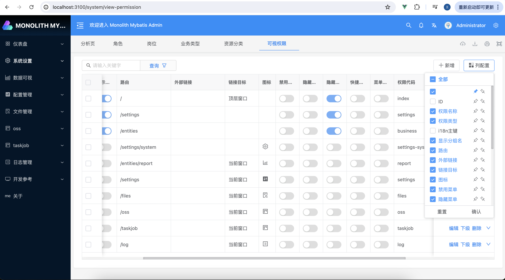

# monolithMybatis

本应用程序由BegCode8.6.1生成, 你可以在 [https://www.begcode.com](https://www.begcode.com) 找到文档和帮助。

## 截图展示

### 登录


### 首页


### 菜单列表



### 角色列表


### 用户列表


### 短信配置


### 图片上传


### 字典管理


### 操作日志


### 消息发布


### Api列表


### Icon选择参考


### 查看通知


## 项目结构

生成时需要 Node，并建议在开发过程中使用它。package.json 文件始终会生成，以提供更好的开发体验，包括 prettier、commit hooks、脚本等等。

在项目的根目录中，JHipster会生成用于配置诸如git、prettier、eslint、husky等众多常见工具的配置文件。你可以在网络上找到有关这些工具的参考文档。

`/src/*` 目录结构遵循默认的Java结构。

- `.yo-rc.json` - Yeoman配置文件（BegCode/JHipster配置文件）
  BegCode的配置存储在key为generator-begcode的属性中，这里定义了BegCode生成器的全局配置。此外，你可能会在项目根目录下的.yo-rc.json文件中找到类似generator-begcode-\*的蓝图配置，它包含了项目特定的配置选项。
- `.yo-resolve` (可选) - Yeoman 冲突解决器
  允许在发现冲突时使用特定操作，跳过匹配模式的文件的提示。每一行应该匹配 [模式] [操作]，其中模式是一个 Minimatch 模式，操作是 skip（如果省略则为默认操作）或者 force 中的一个。以 # 开头的行被视为注释，将被忽略。
- `.jhipster/*.json` - JHipster实体配置文件

- `npmw` - 用于本地安装的npm的包装器
  JHipster默认使用构建工具在本地安装Node和npm。此包装器确保本地安装npm并使用它，避免了不同版本可能引起的一些差异。通过使用./npmw而不是传统的npm，您可以配置一个无需Node的环境来开发或测试您的应用程序。
- `/src/main/docker` - 应用程序及其依赖的服务的Docker配置

## 开发

The build system will install automatically the recommended version of Node and pnpm.

We provide a wrapper to launch pnpm.
仅当 [package.json](package.json) 中的依赖项发生更改时，您才需要再次运行此命令。

```
./npmw install
```

我们使用 pnpm 脚本和 [Vite][] 作为我们的构建系统。

在两个单独的终端中运行以下命令，以创建更好的开发体验，其中当硬盘上的文件发生更改时您的浏览器自动刷新。

```
./mvnw
./npmw start
```

Npm 还用于管理此应用程序中使用的 CSS 和 JavaScript 依赖项。 您可以通过以下方式升级依赖项
在 [package.json](package.json) 中指定较新版本。 您还可以运行`pnpm update`和`pnpm install`来管理依赖项。
在任何命令上添加`help`标志以查看如何使用它。 例如，`pnpm help update`。

`./npmw run` 命令将列出可用于该项目运行的所有脚本。

## 系统构建

### 创建Jar包

要优化monolithMybatis应用程序创建Jar包并进行生产部署，请运行：

```
./mvnw package -Pprod clean verify -DskipTests
```

这将压缩客户端和重新打包CSS和JavaScript文件。 它还将修改`index.html`，以便引用这些新文件。
为了确保一切正常，请运行：

```
java -jar target/*.jar
```

然后在浏览器打开：[http://localhost:8080](http://localhost:8080)。

请参阅[Using JHipster in production][] 了解更多详细信息。

### 创建War包

要将您的应用程序打包为 war 以便将其部署到应用程序服务器，请运行：

```
./mvnw package -Pprod,war clean verify
```

### JHipster Control Center

JHipster Control Center 可以帮助您管理和控制您的应用程序。 您可以使用以下命令启动本地控制中心服务器（可通过 http://localhost:7419 访问）：

```
docker compose -f src/main/docker/jhipster-control-center.yml up
```

## 测试

### Spring Boot tests

To launch your application's tests, run:

```
./mvnw verify
```

### Client tests

Unit tests are run by [Jest][]. They're located in [front/src/test/javascript/](front/src/test/javascript/) and can be run with:

```
./npmw test
```

## 其他

### 使用Sonar进行代码质量控制

Sonar用于分析代码质量。 您可以使用以下命令启动本地 Sonar 服务器（可通过 http://localhost:9001 访问）：

```
docker compose -f src/main/docker/sonar.yml up -d
```

Note: we have turned off forced authentication redirect for UI in [src/main/docker/sonar.yml](src/main/docker/sonar.yml) for out of the box experience while trying out SonarQube, for real use cases turn it back on.

You can run a Sonar analysis with using the [sonar-scanner](https://docs.sonarqube.org/display/SCAN/Analyzing+with+SonarQube+Scanner) or by using the maven plugin.

Then, run a Sonar analysis:

```
./mvnw -Pprod clean verify sonar:sonar -Dsonar.login=admin -Dsonar.password=admin
```

If you need to re-run the Sonar phase, please be sure to specify at least the `initialize` phase since Sonar properties are loaded from the sonar-project.properties file.

```
./mvnw initialize sonar:sonar -Dsonar.login=admin -Dsonar.password=admin
```

Additionally, Instead of passing `sonar.password` and `sonar.login` as CLI arguments, these parameters can be configured from [sonar-project.properties](sonar-project.properties) as shown below:

```
sonar.login=admin
sonar.password=admin
```

For more information, refer to the [Code quality page][].

### Using Docker to simplify development (optional)

You can use Docker to improve your JHipster development experience. A number of docker-compose configuration are available in the [src/main/docker](src/main/docker) folder to launch required third party services.

For example, to start a mysql database in a docker container, run:

```
docker compose -f src/main/docker/mysql.yml up -d
```

To stop it and remove the container, run:

```
docker compose -f src/main/docker/mysql.yml down
```

You can also fully dockerize your application and all the services that it depends on.
To achieve this, first build a docker image of your app by running:

```
npm run java:docker
```

Or build a arm64 docker image when using an arm64 processor os like MacOS with M1 processor family running:

```
npm run java:docker:arm64
```

Then run:

```
docker compose -f src/main/docker/app.yml up -d
```

When running Docker Desktop on MacOS Big Sur or later, consider enabling experimental `Use the new Virtualization framework` for better processing performance ([disk access performance is worse](https://github.com/docker/roadmap/issues/7)).

For more information refer to [Using Docker and Docker-Compose][], this page also contains information on the docker-compose sub-generator (`jhipster docker-compose`), which is able to generate docker configurations for one or several JHipster applications.

## Continuous Integration (optional)

To configure CI for your project, run the ci-cd sub-generator (`jhipster ci-cd`), this will let you generate configuration files for a number of Continuous Integration systems. Consult the [Setting up Continuous Integration][] page for more information.

[BegCode最新文档]: https://www.begcode.com
[Node.js]: https://nodejs.org/
[NPM]: https://www.npmjs.com/
[Webpack]: https://webpack.github.io/
[BrowserSync]: https://www.browsersync.io/
[Jest]: https://facebook.github.io/jest/
[Leaflet]: https://leafletjs.com/
[DefinitelyTyped]: https://definitelytyped.org/
